# GRPC-JAVA使用总结（2022-3-2）
‍‍​​​​​​​​​‌​‌​‌‌‌​​​​​​​​​‌‌​​​​‌​​​​​​​​​‌‌​‌‌​​​​​​​​​​​‌‌‌​‌​​​​​​​​​​​‌‌​​‌​‌​​​​​​​​​‌‌‌​​‌​​​​​​​​​​​‌​​​​​​​​​​​​​​‌​‌​‌‌‌​​​​​​​​​‌‌​​​​‌​​​​​​​​​‌‌​‌‌‌​​​​​​​​​​‌‌​​‌‌‌‍‍
> Author: Walter Wang

### 1. 讲解

#### 1.1 GPRC简介

gRPC 是Google开源的高性能、通用的RPC框架。客户端与服务端约定接口调用， 可以在各种环境中运行，具有跨语言特性， 适合构建分布式、微服务应用。

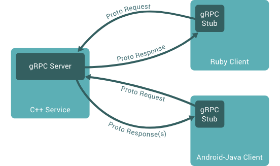

#### 1.2 GPRC特性

+ 性能优异：

  1. 采用Proto Buffer作序列化传输， 对比JSON与XML有数倍提升。

  2. 采用HTTP2协议， 头部信息压缩， 对连接进行复用， 减少TCP连接次数。

  3. gRPC底层采用Netty作为NIO处理框架， 提升性能。
+ 多语言支持，多客户端接入， 支持C++/GO/Ruby等语言。
+ 支持负载均衡、跟踪、健康检查和认证。

#### 1.3 GPRC线程模型

gRPC 的线程模型遵循 Netty 的线程分工原则，协议层消息的接收和编解码由 Netty 的 I/O(NioEventLoop) 线程负责, 应用层的处理由应用线程负责，防止由于应用处理耗时而阻塞 Netty 的 I/O 线程。
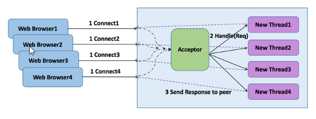
BIO线程模型采用了线程池，但是后端的应用处理线程仍然采用同步阻塞的模型，阻塞的时间取决对方I/O处理的速度和网络I/O传输的速度。

采用线程池模式的BIO:

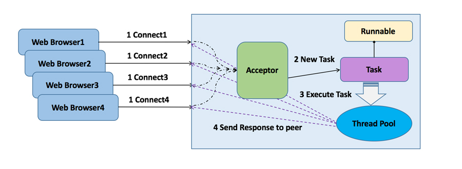

 NIO 线程模型(Reactor模式): 

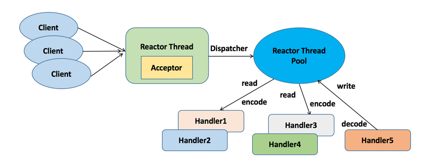


#### 1.4 客户端调用流程

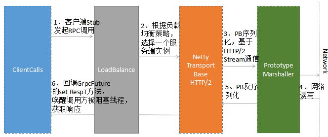

1. 客户端 Stub 调用 发起 RPC 调用 远程服务。
2. 获取服务端的地址信息（列表），使用默认的 LoadBalancer 策略，选择一个具体的 gRPC 服务端。
3. 如果与服务端之间没有可用的连接，则创建 NettyClientTransport 和 NettyClientHandler，建立 HTTP/2 连接。
4. 对请求使用 PB（Protobuf）序列化，通过 HTTP/2 Stream 发送给 gRPC 服务端。
5. 服务端接收到响应之后，使用 PB（Protobuf）做反序列化。
6. 回调 GrpcFuture 的 set(Response) 方法，唤醒阻塞的客户端调用线程，获取 RPC 响应数据。


#### 1.5 GRpc vs Rest 性能对比

1. GRpc与Rest性能对比

   在不同操作系统平台, 不同请求数的对比:
   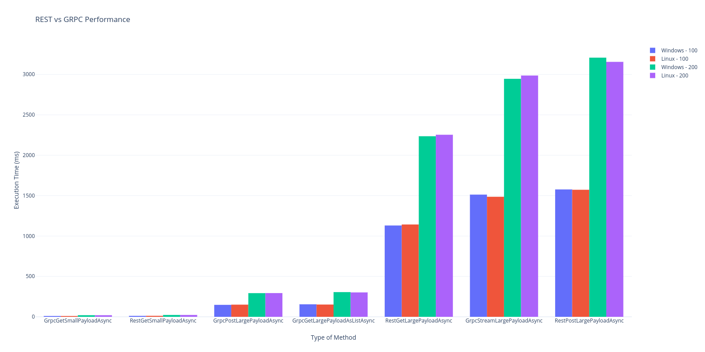
   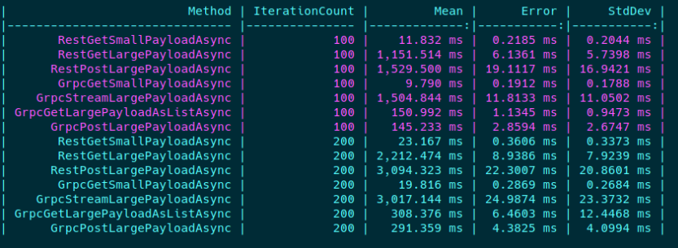


2. GRpc + ProtoBuf 与Rest(Http+Json)性能对比

   [Go项目测试地址](https://github.com/plutov/benchmark-grpc-protobuf-vs-http-json)

   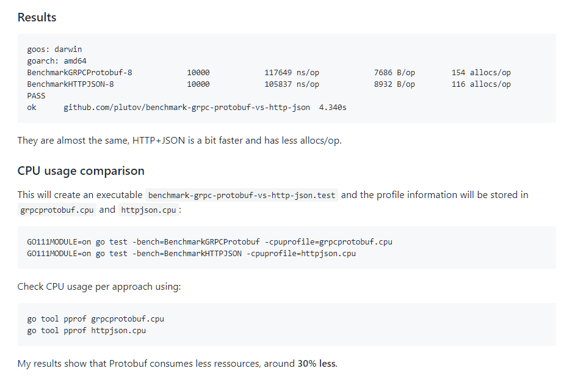

   实测结果显示GRpc的通讯方案, 性能有32%的提升, 资源占用降低30%左右。

#### 1.7 工程结构

|- grpc-demo
  |-- grpc-client
  |-- grpc-lib
  |-- grpc-server

+ grpc-demo : 父级工程， 管理依赖相关。
+ grpc-client: 客户端工程，负责调用gRPC服务, 提供HTTP服务触发。
+ grpc-server: 股票服务端工程， 提供股票价格接口。
+ grpc-lib: 公用工程，生成为protobuf对象与gRPC Service。

#### 1.8 Protoc编译工具（protoc-gen-grpc-java目前mac的m1芯片不可用）

下载工具： [protoc](https://github.com/protocolbuffers/protobuf)

~~~text
可根据github地址去下载找到README.md，选择你想要的版本
~~~

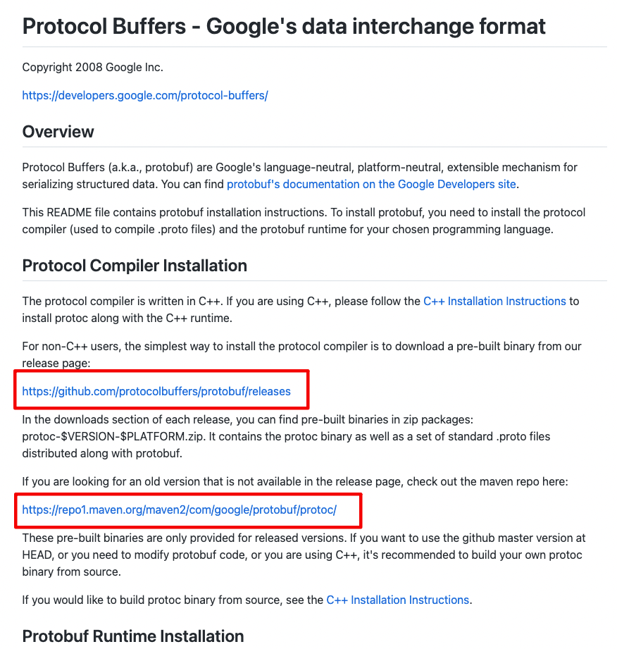

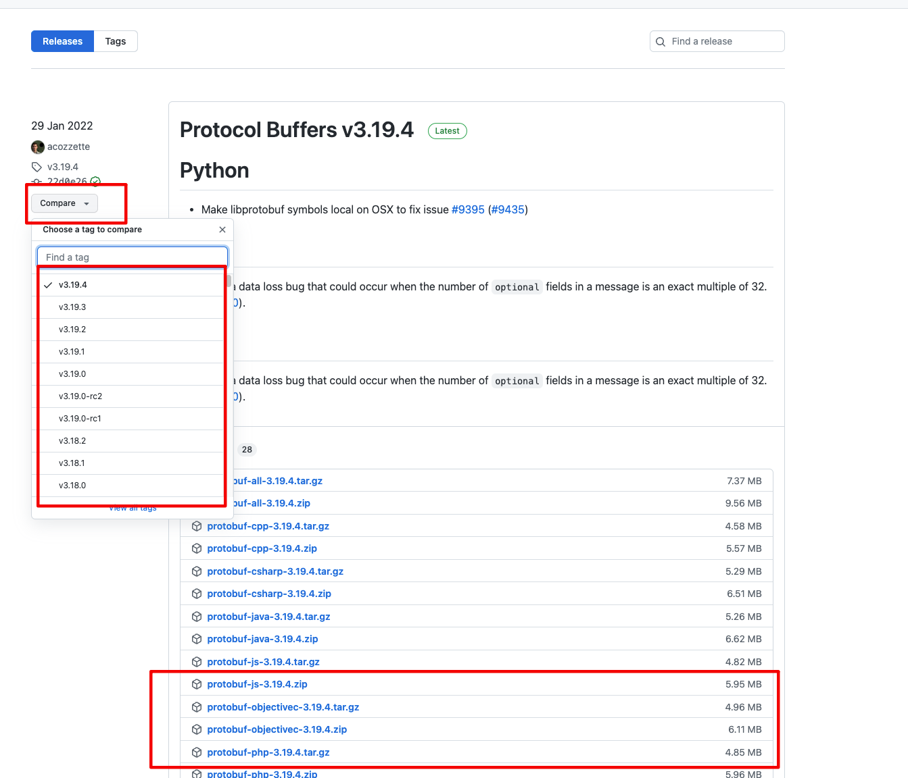

下载插件： [protoc-gen-grpc-java](https://github.com/grpc/grpc-java/tree/master/compiler)

~~~
或者自己编译下载源代码
~~~

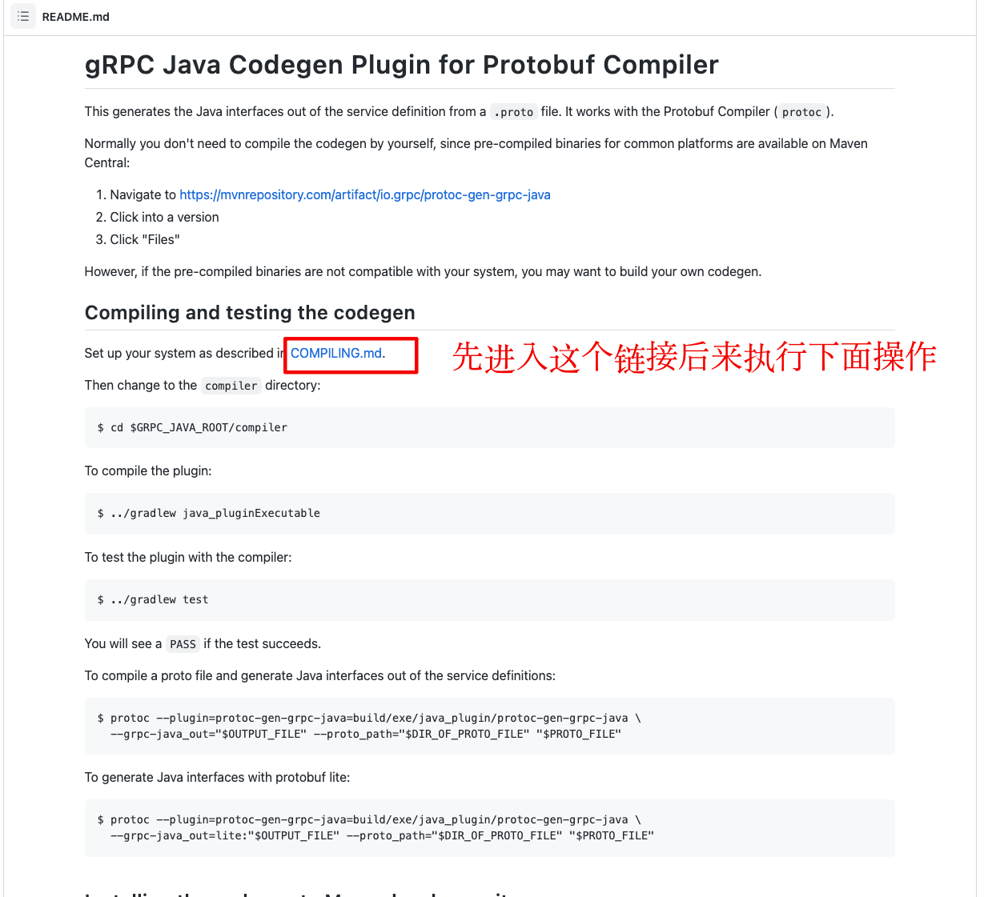

#### 1.9 工程说明

1. **grpc-demo**

   POM文件

   ```xml
     <dependencies>
          <!-- spring boot grpc 服务端依赖 -->
           <dependency>
               <groupId>net.devh</groupId>
               <artifactId>grpc-server-spring-boot-starter</artifactId>
               <version>2.5.0.RELEASE</version>
           </dependency>
           <!-- spring boot grpc 客户端依赖 -->
           <dependency>
               <groupId>net.devh</groupId>
               <artifactId>grpc-client-spring-boot-starter</artifactId>
               <version>2.5.0.RELEASE</version>
           </dependency>
       </dependencies>
   ```


2. **grpc-lib公用组件工程**

   StockService.proto文件：

   ```protobuf
   syntax = "proto3";
   
   option java_multiple_files = true;
   option java_package = "com.itcast.grpc.lib";
   option java_outer_classname = "StockServiceProto";
   
   // The stock service definition.
   service StockService {
       // get stock price by name
       rpc GetStockPrice (StockServiceRequest) returns (StockServiceReply) {
       }
   }
   
   // The request message
   message StockServiceRequest {
       string name = 1;
   }
   
   // The response message
   message StockServiceReply {
       string message = 1;
   }
   
   ```

   POM依赖

   ```xml
   <dependencies>
            <!--Protobuf 依赖组件, 版本采用的3.8.0 -->
           <dependency>
               <groupId>com.google.protobuf</groupId>
               <artifactId>protobuf-java</artifactId>
               <version>3.8.0</version>
           </dependency>
           <dependency>
               <groupId>io.grpc</groupId>
               <artifactId>grpc-netty-shaded</artifactId>
               <version>1.22.1</version>
           </dependency>
           <!-- 避免Protobuf java 出现的问题, 做了排除 -->
           <dependency>
               <groupId>io.grpc</groupId>
               <artifactId>grpc-protobuf</artifactId>
               <version>1.22.1</version>
               <exclusions>
                   <exclusion>
                       <artifactId>protobuf-java</artifactId>
                       <groupId>com.google.protobuf</groupId>
                   </exclusion>
               </exclusions>
           </dependency>
           <dependency>
               <groupId>io.grpc</groupId>
               <artifactId>grpc-stub</artifactId>
               <version>1.22.1</version>
           </dependency>
   </dependencies>
   ```

   注意Protobuf生成工具和组件要保持一致， 工具我们用的是3.8.0最新版， 依赖也要改成3.8.0，排除了grpc-protobuf的传递依赖。

进入proto文件目录， 执行以下命令， 生成gRPC对象与Service:

   ```protobuf
d:/TestCode/protoc.exe --plugin=protoc-gen-grpc-java=d:/TestCode/protoc-grpc.exe --java_out=./ --grpc-java_out=./ StockService.proto
   ```

~~~
/Users/qm-bpg0234/Downloads/protoc-3.8.0-osx-x86_64/bin/protoc --plugin=protoc-gen-grpc-java=/Users/qm-bpg0234/Downloads/protoc-gen-grpc-java-1.21.1-osx-x86_64.exe --java_out=./ --grpc-java_out=./ StockService.proto
~~~


注意插件路径要写正确， 要指定protobuf与grpc两个输出位置， 命令指定在当前同级目录生成协议文件。

3. **grpc-server服务端**
   GrpcStockService类， 重写gRPC Service定义的接口，生成指定范围随机数的价格 ：

   ```java
   @GrpcService
   public class GrpcStockService extends StockServiceGrpc.StockServiceImplBase {
   
       @Override
       public void getStockPrice(StockServiceRequest request, StreamObserver<StockServiceReply> responseObserver) {
           String msg = "股票名称:" + request.getName() + ", 股票价格:" + (new Random().nextInt(100-20)+20);
           StockServiceReply reply =StockServiceReply.newBuilder().setMessage(msg).build();
           responseObserver.onNext(reply);
           responseObserver.onCompleted();
       }
   }
   
   ```

   GrpcServiceStartup启动类：

   ```java
   @SpringBootApplication
   @ComponentScan(basePackages = {"com.itcast"})
   public class GrpcServerStartup {
    public static void main(String[] args) {
        SpringApplication.run(GrpcServerStartup.class, args);
    }
   }
   
   
   ```

4. **grpc-client客户端**

   GrpcClientService类：

   ```java
   @Service
   public class GrpcClientService {
   
       @GrpcClient("grpc-server")
       private StockServiceGrpc.StockServiceBlockingStub stockServiceStub;
   
       public String getStockPrice(final String name) {
           try {
               final StockServiceReply response = stockServiceStub.getStockPrice(StockServiceRequest.newBuilder().setName(name).build());
               return response.getMessage();
           } catch (final StatusRuntimeException e) {
               return "error!";
           }
       }
   }
   ```

   注解GrpcClient映射的名称为grpc-server， 不能随便填写，要与配置保持一致。
   GrpcClientApplication启动类：

   ```java
   @SpringBootApplication
   @RestController
   @ComponentScan(basePackages = {"com.itcast"})
   public class GrpcClientApplication {
   
       @Autowired
       private GrpcClientService grpcClientService;
   
       public static void main(String[] args) {
           SpringApplication.run(GrpcClientApplication.class, args);
       }
   
       @RequestMapping("/")
       public String getStockPrice(@RequestParam(defaultValue = "中国平安") String name) {
           return grpcClientService.getStockPrice(name);
       }
   }  
   
   ```

   application.yml配置文件：

   ```yml
   server:
     port: 9000
   spring:
     application:
       name: grpc-client
   
   grpc:
     client:
       grpc-server:
         address: 'static://127.0.0.1:9999'
         enableKeepAlive: true
         keepAliveWithoutCalls: true
         negotiationType: plaintext
   
   ```

   这里面定义名为【grpc-server】的服务配置信息， 与上面注解要保持一致。

   

#### 1.10 启动验证

启动服务端与客户端， 访问客户端地址： http://127.0.0.1:9000/getStockPrice?name=中国银行
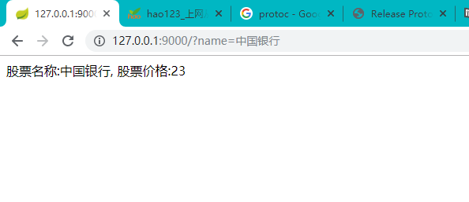

不断刷新请求， 股票价格也会随机变化，能够正常结合Spring Boot访问gRPC服务。


## 2. gRPC-Java 2026 版本演进

> 🔄 更新于 2026-07-10

<!-- version-check: gRPC-Java 1.82.1, Netty 4.2.16 / 4.1.136（安全修复版）, Spring gRPC 1.0.x, Protobuf 29.x, checked 2026-07-10 -->
<!-- 修复于 2026-07-10（P0，安全相关）: gRPC-Java 1.78.0/1.80.0（文本与代码版本号原不一致）统一更新为最新稳定版 1.82.1；Netty 4.1.132/4.2.12 存在已知 CVE，升级到修复版 4.1.136/4.2.16 -->

### 2.1 gRPC-Java 版本跃升

gRPC-Java 当前稳定版为 **1.82.1**（2026-06-23 发布），相比本文档中使用的 1.22.1 有巨大变化。来源：[gRPC-Java Releases](https://github.com/grpc/grpc-java/releases)

**关键版本里程碑：**

| 版本范围 | 重要变化 |
|---------|---------|
| 1.22→1.40 | xDS 负载均衡、Binder Transport（Android） |
| 1.40→1.55 | OpenTelemetry 集成、Rls（路由查找服务） |
| 1.55→1.70 | Java 11 最低要求、Protobuf 4.x 支持 |
| 1.70→1.82 | Java 17 推荐、Virtual Threads 支持、性能优化 |

**2026 年推荐依赖版本：**

```xml
<properties>
    <grpc.version>1.82.1</grpc.version>
    <protobuf.version>4.29.3</protobuf.version>
    <netty.version>4.1.136.Final</netty.version>
</properties>

<dependencies>
    <dependency>
        <groupId>io.grpc</groupId>
        <artifactId>grpc-netty-shaded</artifactId>
        <version>${grpc.version}</version>
    </dependency>
    <dependency>
        <groupId>io.grpc</groupId>
        <artifactId>grpc-protobuf</artifactId>
        <version>${grpc.version}</version>
    </dependency>
    <dependency>
        <groupId>io.grpc</groupId>
        <artifactId>grpc-stub</artifactId>
        <version>${grpc.version}</version>
    </dependency>
</dependencies>
```

### 2.2 Netty 4.2 版本演进

Netty 当前有两个活跃分支。来源：[Netty Downloads](https://netty.io/downloads)

| 分支 | 最新版本 | 状态 | JDK 要求 |
|------|---------|------|---------|
| 4.1.x | 4.1.136.Final（2026-07-08，安全修复版） | 稳定，推荐 | JDK 6+ |
| 4.2.x | 4.2.16.Final（2026-07-07，安全修复版） | 稳定，推荐 | JDK 11+ |
| 5.0.x | 5.0.0.Alpha5 | 开发中 | JDK 11+ |

> ⚠️ 4.1.132.Final / 4.2.12.Final 及更早版本存在已披露安全漏洞，生产环境应升级到上表最新修复版本。

**Netty 4.2 核心变化：**
- 最低 JDK 11（4.1.x 仍支持 JDK 6）
- 新的 Buffer API（为 Netty 5 做准备）
- io_uring 传输支持（Linux 高性能 I/O）
- 性能优化和安全修复

### 2.3 Spring gRPC — 官方 Spring 集成

> 🔄 更新于 2026-05-02

Spring 官方推出了 **Spring gRPC** 框架（`org.springframework.grpc`），替代了之前社区维护的 `grpc-spring-boot-starter`（`net.devh`）。来源：[Spring gRPC Reference](https://docs.spring.io/spring-grpc/reference/getting-started.html)

**重要变化：**
- Spring gRPC 1.0.x 支持 **Spring Boot 4.1.x**
- 旧的 `net.devh:grpc-server-spring-boot-starter`（本文档使用的）已不再推荐
- `grpc-ecosystem/grpc-spring`（3.6K Stars）仍在维护，但新项目推荐 Spring 官方版本

```xml
<!-- 2026 年推荐：Spring gRPC 官方 Starter -->
<dependency>
    <groupId>org.springframework.grpc</groupId>
    <artifactId>spring-grpc-spring-boot-starter</artifactId>
    <version>1.0.0</version>
</dependency>
```

来源：[Spring gRPC Next Steps for 1.0.0](https://spring.io/blog/2025/11/05/spring-grpc-next-steps/)

### 2.4 Protobuf 版本演进

| 版本 | 发布时间 | 关键变化 |
|------|---------|---------|
| 3.x | 旧版 | 本文档使用的版本 |
| 4.x（Edition 2023） | 2023 | 统一 proto2/proto3 语法为 Editions |
| 4.29.x | 2026 | 当前稳定版，推荐新项目使用 |

### 2.5 版本选择建议

| 场景 | 推荐方案 |
|------|---------|
| Spring Boot 4.x 新项目 | Spring gRPC 1.0.x + gRPC-Java 1.78+ |
| Spring Boot 3.x 项目 | grpc-ecosystem/grpc-spring 3.x |
| 非 Spring 项目 | gRPC-Java 1.78+ 原生 API |
| Android 客户端 | gRPC-Java 1.78+（Binder Transport） |
| 高性能场景 | Netty 4.2.x + io_uring（Linux） |


